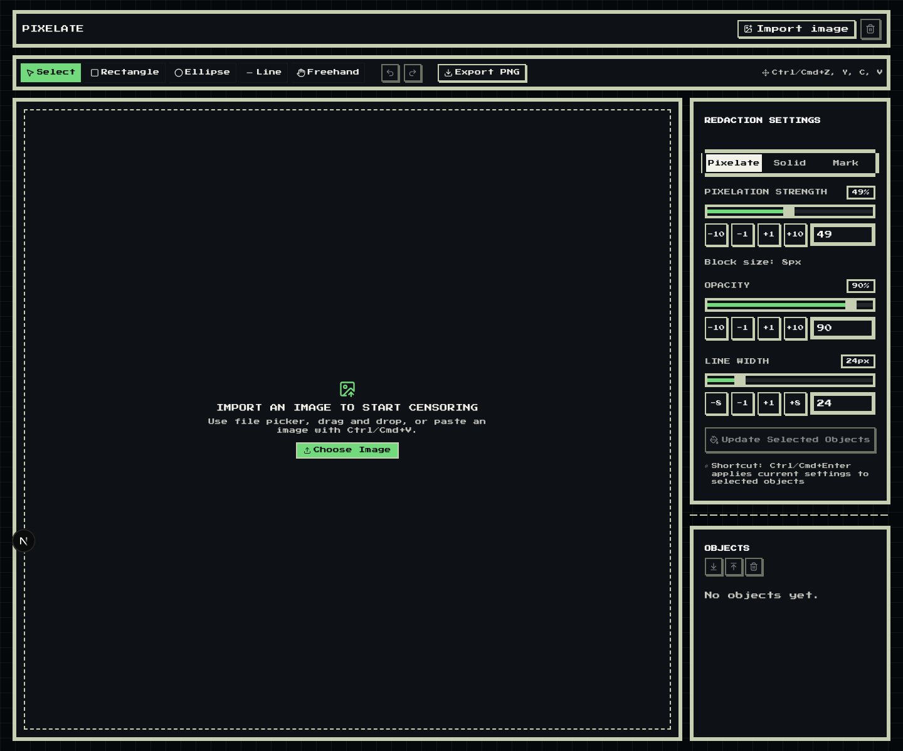

# Pixelate

A fast, client-only image redaction tool that runs entirely in your browser.

`Pixelate` lets you import an image, draw redaction shapes, apply pixelate or solid fill effects, and export a flattened PNG. No backend, no uploads, no server storage.

## Preview



## Highlights

- 100% local processing (privacy-first)
- Import via file picker, drag-and-drop, and clipboard paste (`Ctrl/Cmd + V`)
- Redaction tools: rectangle, ellipse, line, freehand
- Redaction styles: pixelate (mosaic) and solid fill
- Deterministic renderer: always re-renders from original image + edit list
- Undo/redo support (`Ctrl/Cmd + Z`, `Ctrl/Cmd + Y`)
- Selection, move/resize, delete, copy/paste redaction objects
- PNG export with preview/export parity (WYSIWYG)

## Tech Stack

- Bun
- Next.js (App Router)
- TypeScript
- Tailwind CSS
- shadcn/ui
- Biome (lint/format)
- Playwright (smoke checks)
- Devbox

## Requirements

- One of:
  - Devbox
  - Bun + Node.js

## Run Locally

### Option 1: Devbox (recommended)

```bash
devbox shell
bun install
bun dev
```

App: [http://localhost:3000](http://localhost:3000)

### Option 2: Bun directly

```bash
bun install
bun dev
```

## Quality Gates

```bash
bun run lint
bun run build
```

## Smoke Check (Playwright)

Start the app in one terminal:

```bash
bun dev --port 3005
```

Run smoke in another terminal:

```bash
SMOKE_BASE_URL=http://localhost:3005 bash src/dev/playwright/run-smoke.sh
```

Artifacts:

- Exports/check outputs: `output/playwright/`
- Visual proof screenshots: `docs/`

## Keyboard Shortcuts

- `Ctrl/Cmd + Z`: Undo
- `Ctrl/Cmd + Y`: Redo
- `Delete`: Delete selected redactions
- `Esc`: Clear selection / cancel placement
- `Ctrl/Cmd + C`: Copy selected shapes
- `Ctrl/Cmd + V`: Paste shapes (or image from clipboard)

## Project Structure

- `src/app` → Next.js app entry, layout, global styles
- `src/features/editor` → redaction domain (state, renderer, geometry, interactions)
- `src/components/ui` → shadcn/ui components
- `src/dev/playwright` → smoke automation scripts and checklist
- `tests/fixtures` → input images used by smoke checks

## Notes

- The UI is dark-mode only by design.
- Static export-friendly setup is enabled in `next.config.ts`.
- This project is intended for offline/local usage after initial app load.
